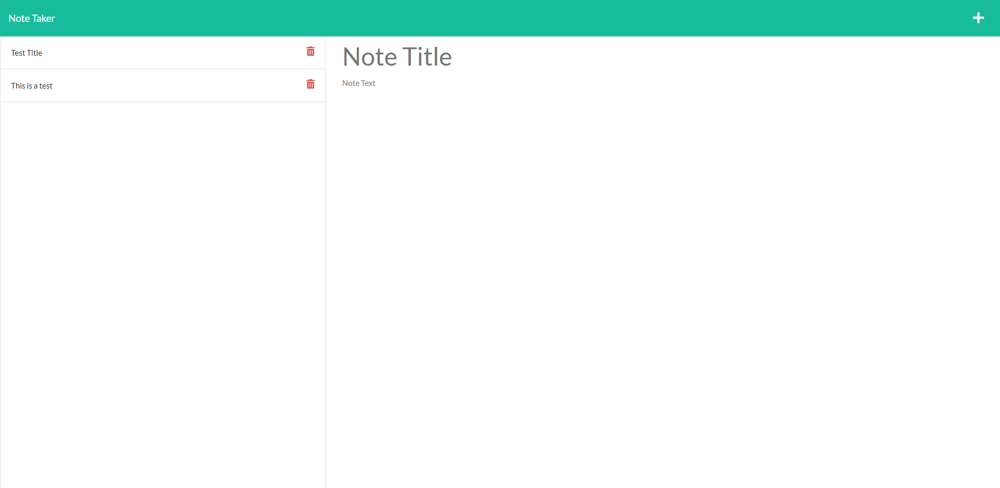

# Note-Taker-App

## Description
This project is an application to take notes. It will allow you to add and delete notes as needed. I created this application utilizing Express.js, the notes will store in a JSON file instead of in local storage. This application was difficult to work on since it was the first attempt at connecting the front end to back end services.

## Table of Contents (Optional)

- [Installation](#installation)
- [Usage](#usage)
- [Credits](#credits)
- [License](#license)
## Installation

To get this project working for yourself you can clone it down from GitHub. Once cloned down (npm i) on the terminal. Once all the installations have completed run (node server.js)
## Usage
The below link should take you to the deployed paged. 
https://fathomless-stream-10357.herokuapp.com/

I have attached a screenshot of the project below: 
    
## Credits
List your collaborators, if any, with links to their GitHub profiles.
If you used any third-party assets that require attribution, list the creators with links to their primary web presence in this section.
If you followed tutorials, include links to those here as well.
## License
- MIT License

Copyright (c) [2021] [Aaron Donelson]

## Badges

